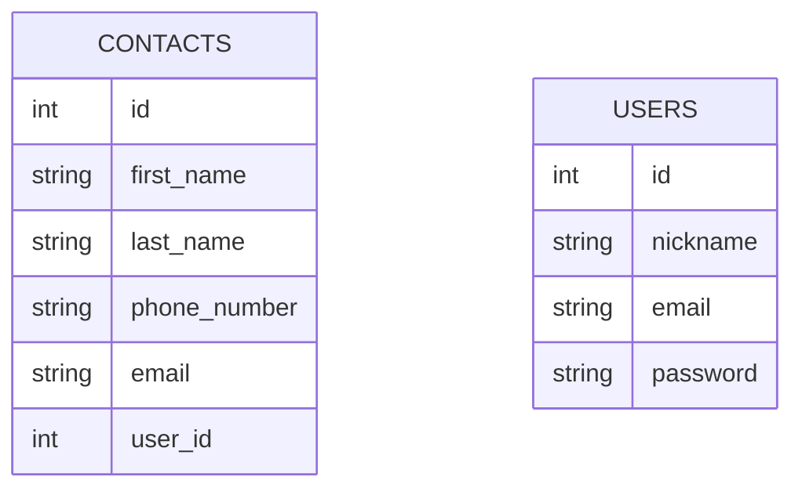

# phone-book
Phone Book FastAPI

API with CRUD(create, read, update, delete) operations with corresponding endpoints provided.

Documentation available at:
```bash
  127.0.0.1:8000/docs
```
## How to use
Postgres was used to create the application. To connect to the database, complete the details in the config.py file.

```bash
DATABASE_USERNAME = ''
DATABASE_PASSWORD = ''
DATABASE_HOST = ''
DATABASE_NAME = ''
```
To install all required packages run:

```bash
pip install -r requirements.txt
```
To start an app run:

```bash
uvicorn main:app --reload --port 8000
```
Then run migration using the command:
```
alembic upgrade head
```
## Models

